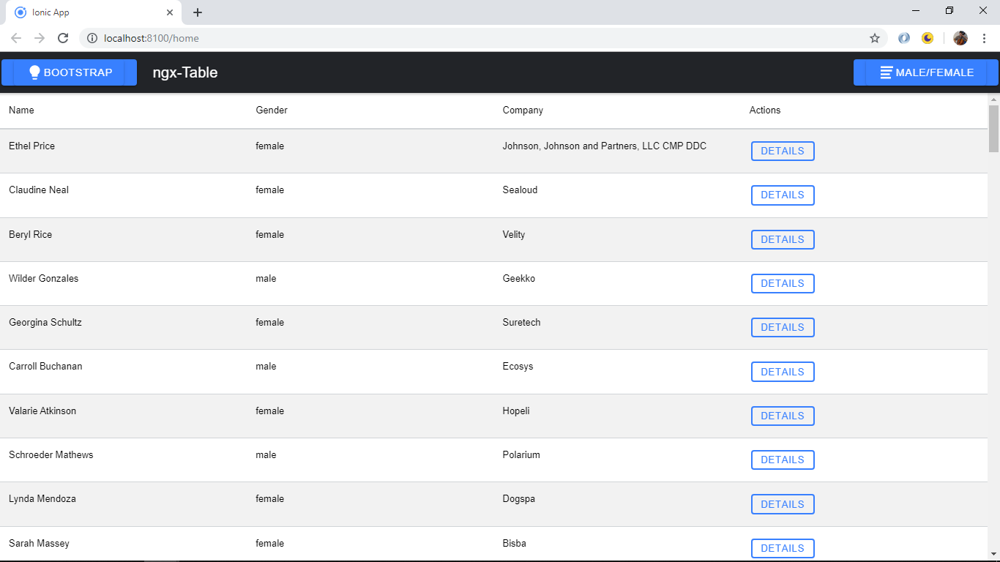
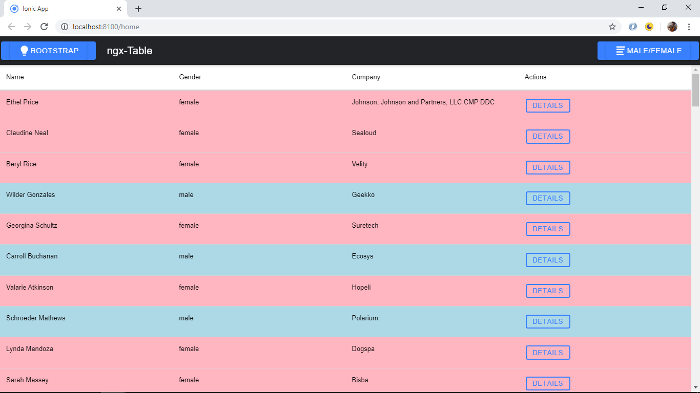

# :zap: Ionic Angular Data Table

* App to show json data table, using [Swimlane npm module 'ngx-datatable'](https://github.com/swimlane/ngx-datatable) and the [Ionic 5 framework](https://ionicframework.com/docs).
* This is another great Ionic Quick Win from [Simon Grimm IonicAcademy Youtube video 'Creating Ionic Datatable With ngx-datatable'](https://www.youtube.com/watch?v=Ji52_xdxkDg).

## :page_facing_up: Table of contents

* [:zap: Ionic Angular Data Table](#zap-ionic-angular-data-table)
  * [:page_facing_up: Table of contents](#page_facing_up-table-of-contents)
  * [:books: General info](#books-general-info)
  * [:camera: Screenshots](#camera-screenshots)
  * [:signal_strength: Technologies](#signal_strength-technologies)
  * [:floppy_disk: Setup](#floppy_disk-setup)
  * [:computer: Code Examples](#computer-code-examples)
  * [:cool: Features](#cool-features)
  * [:clipboard: Status & To-do list](#clipboard-status--to-do-list)
  * [:clap: Inspiration](#clap-inspiration)
  * [:envelope: Contact](#envelope-contact)

## :books: General info

* json data is displayed in a table that is very quickly created using the ngx-datatable module. Buttons are added to hange from Material to Bootstrap styles and also from light to dark mode. Another button changes the classes of the rows so male and female employees are shown in different colours.

## :camera: Screenshots




## :signal_strength: Technologies

* [Ionic v5](https://ionicframework.com/)
* [Ionic/angular v5](https://ionicframework.com/)
* [Angular v10](https://angular.io/)
* [swimlane npm module 'ngx-datatable' v17](http://swimlane.github.io/ngx-datatable/)

## :floppy_disk: Setup

* To start the server on _localhost://8100_ type: 'ionic serve'
* The Ionic DevApp was installed on an Android device from the Google Play app store.

## :computer: Code Examples

* `home.page.html` template to specify data table format.

```html
  <ngx-datatable
  [rows]="companies"
  [ngClass]="tableStyle"
  [rowHeight]="'auto'"
  [headerHeight]="50"
  [columnMode]="'force'"
  [rowClass]="getRowClass.bind(this)">

  <ngx-datatable-column name="Name"></ngx-datatable-column>
  <ngx-datatable-column name="Gender"></ngx-datatable-column>
  <ngx-datatable-column name="Company"></ngx-datatable-column>

  <ngx-datatable-column name="Actions" [sortable]="false">
    <ng-template let-row="row" let-value="value" ngx-datatable-cell-template>
      <ion-button size="small" fill="outline" (click)="open(row)">Details</ion-button>
    </ng-template>
  </ngx-datatable-column>
  </ngx-datatable>
```

## :cool: Features

* Updated to latest ionic/angular versions. Dependencies updated and conflicts resolved

## :clipboard: Status & To-do list

* Status: Working.
* To-do: nothing

## :clap: Inspiration

* [Simon Grimm IonicAcademy Youtube video 'Creating Ionic Datatable With ngx-datatable'](https://www.youtube.com/watch?v=Ji52_xdxkDg)

## :envelope: Contact

* Repo created by [ABateman](https://www.andrewbateman.org) - you are welcome to [send me a message](https://andrewbateman.org/contact)
